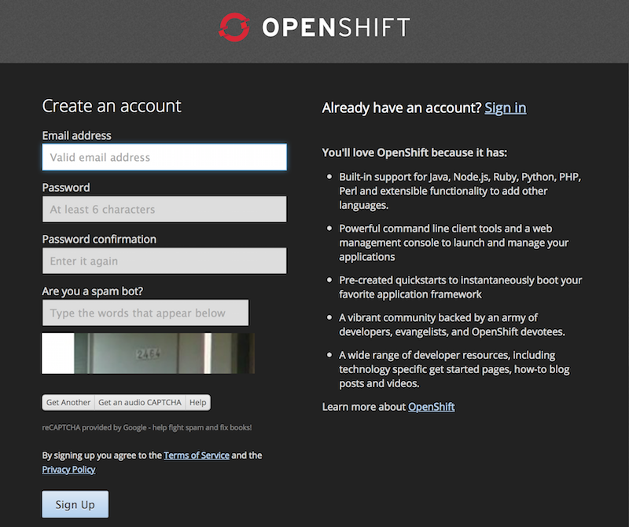
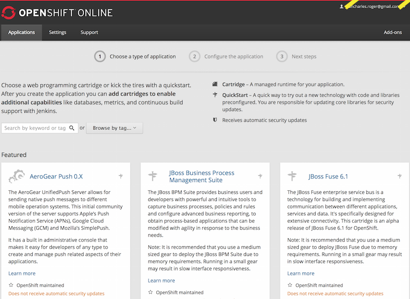
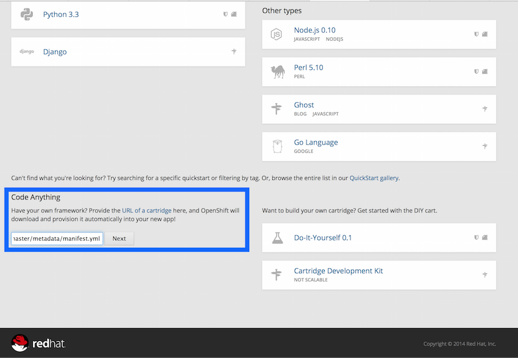
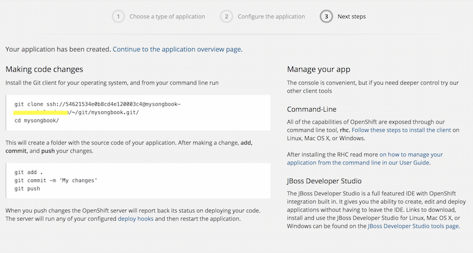

# Songbook on OpenShift

This tutorial presents how to get a SongBook server on OpenShift in a few minutes.
With this tutorial, you will create an application containing a SongBook server on OpenShift servers for free.

## Create an OpenShift account

In order to have access to application creation with OpenShift, you must create an account.
Go to [OpenShift Account Creation](https://openshift.redhat.com/app/account/new?then=%2Fapp%2Faccount&web_user) and create one.
Then you'll have access to a free account allowing you to create 3 small gears. A small gear is more than enough for SongBook.




## Create an application

You now have to create an application.


On your account information click on *Add Application...*.



On the *Choose the type of application* page, go at the bottom of the page.



Copy the SongBook cartridge URL: `https://github.com/kawane/songbook-cartridge/raw/master/metadata/manifest.yml` in the *Code Anything* section and click *Next*.


On the *Configure application* page, set a name (here `songbook`) and click on 'Create Application'.



To access to your server, go on the *Applications* page.
Now your server is up and running, check the [Getting Started](Getting_Started.md) to add your songs.


## For advanced users

If you already use OpenShift, you can use the `rhc` command:


```shell
rhc create-app https://github.com/kawane/songbook-cartridge/raw/master/metadata/manifest.yml -a mysongbook
```


